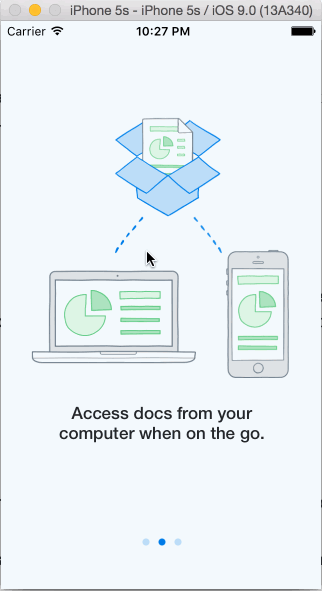

# Dropbox Homework for Codepath

The purpose of this app was to learn how to implement the flow between the screens of an application. It used techniques from week 1 of the course to implement the Dropbox app from the signed out state to the basic signed in state.

Time: I spent around 15 hours on the exercise

## What can the app can do?

* [x] Required: User can tap through the 3 welcome screens.
* [x] Required: User can follow the create user flow.
* [x] Required: On the create user form, the user can tap the back button to go to the page where they can sign in or create an account.
* [x] Required: Before creating the account, user can choose to read the terms of service.
* [x] Required: After creating the account, user can view the placeholders for Files, Photos, and Favorites as well as the Settings screen.
* [x] Required: User can log out from the Settings screen.
* [x] Required: User can follow the sign in flow.
* [x] Required: User can tap the area for "Having trouble signing in?"
* [x] Required: User can log out from the Settings screen.
* [x] Optional: Add UITextFields for the forms so you can actually type in them and handle dismissing the keyboard.*

*The optional work is a stand-alone UIController called: Keyboard Sign In View Controller.  (Didn't have time to tie it into the flow)

Walkthrough of all the app stories:

 
The GIF was created with [LiceCap](http://www.cockos.com/licecap/).
